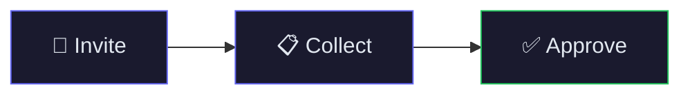
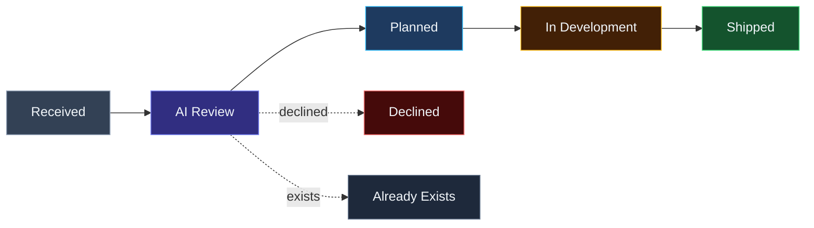
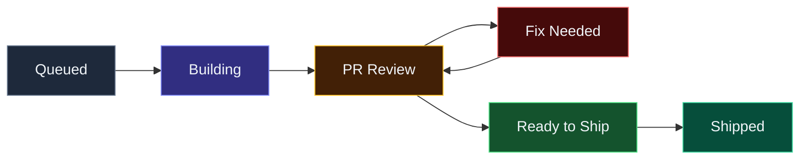
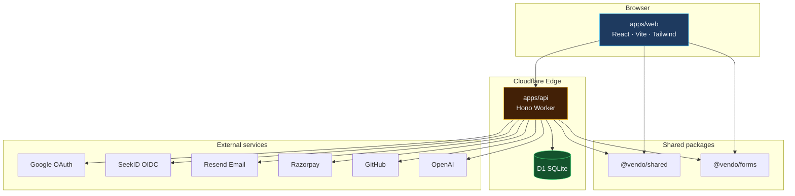

<div align="center">

# ✦ Vendo

### Onboard vendors fast.

**Invite · Verify · Approve** — without the WhatsApp-and-spreadsheet chaos.

<br />

[](https://github.com/buildwithrenuka/vendo)
[](https://github.com/buildwithrenuka/vendo)

<br />

[](https://nodejs.org/)
[](https://www.typescriptlang.org/)
[](https://workers.cloudflare.com/)
[](https://react.dev/)
[](https://hono.dev/)
[](https://tailwindcss.com/)

<br />

A procurement platform for buyers worldwide — share a link on **WhatsApp**, **email**, or **SMS**,  
collect compliance docs, auto-approve clear cases, and keep finance audit-ready.

**Free to start** · up to 3 suppliers · no credit card

<br />

[Quick Start](#-quick-start) · [Features](#-features) · [Architecture](#-architecture) · [API](#-api) · [Deploy](#-deployment) · [GitHub](https://github.com/buildwithrenuka/vendo)

<br />

```bash
git clone https://github.com/buildwithrenuka/vendo.git
cd vendo
```

</div>

---

## ✨ At a glance

<table>
<tr>
<td width="50%" valign="top">

#### 🏢 For buyers

- Message-first supplier invites
- Versioned compliance forms
- Plain-language auto-approval rules
- Green / yellow / red scorecards
- GST & invoice reconciliation *(Enterprise)*
- Feature requests with live status

</td>
<td width="50%" valign="top">

#### 🚚 For suppliers

- Sign in with Google in seconds
- One checklist — tax IDs, certs, bank details
- **Verify once, reuse everywhere**
- Track submission status in one place

</td>
</tr>
</table>

### The 3-step flow



| Step | What happens |
|:----:|--------------|
| **1 · Invite** | Create a secure link from your dashboard — share on any channel |
| **2 · Collect** | Supplier fills your form; docs are versioned & audit-ready |
| **3 · Approve** | Valid submissions pass your rules instantly — only edge cases need you |

---

## 🎯 Features

### Buyer dashboard — `/dashboard`

```
┌─────────────┬─────────────┬──────────────────────┬──────────────┐
│  Overview   │  Suppliers  │        Setup         │   Feedback   │
├─────────────┼─────────────┼──────────────────────┼──────────────┤
│ Stats       │ Invites     │ Form builder         │ Feature reqs │
│ Quick share │ Scorecards  │ Approval rules (NL)  │ Bug reports  │
│ Activity    │ Submissions │ GST reconciliation   │ AI triage    │
└─────────────┴─────────────┴──────────────────────┴──────────────┘
```

| Capability | Description |
|------------|-------------|
| 💬 **WhatsApp invites** | Share onboarding links where suppliers already are |
| 📋 **Form builder** | Custom fields — text, files, dates, selects — versioned per buyer |
| ⚡ **Auto-approve** | Describe rules in plain English; clear docs approve in seconds |
| 🧾 **GST matching** | Match supplier invoices against onboarded GST numbers |
| 📊 **Scorecards** | Traffic-light ratings from onboarding & review history |
| 💡 **Feature requests** | Every request tracked — never lost in a black hole |

### Feature request lifecycle



AI assesses business fit, detects existing features, and asks clarifying questions before engineering picks it up.

### ShipFlow — internal dev queue — `/internal`



OpenAI code generation · GitHub PRs · task kanban · AI code review · activity timeline · employee admin panel.

---

## 🏗 Architecture



### Tech stack

| Layer | Stack |
|-------|-------|
| **API** | Cloudflare Workers · Hono · D1 (SQLite) |
| **Web** | React 19 · Vite 6 · Tailwind CSS 4 |
| **Auth** | Google OAuth · SeekID (Poll-Seeker OIDC) · Employee login |
| **Email** | Resend |
| **Payments** | Razorpay |
| **AI** | OpenAI — triage · code builder · PR review |

### Monorepo

```
vendo/
│
├── apps/
│   ├── api/                 #  Cloudflare Worker — routes, services, D1 migrations
│   └── web/                 #  React SPA — landing, dashboard, internal tools
│
├── packages/
│   ├── shared/              #  Types, constants, status labels
│   └── forms/               #  Zod schemas, field catalog, form flow
│
└── package.json             #  npm workspaces root
```

---

## 🚀 Quick start

### Prerequisites

| Tool | Version |
|------|---------|
| Node.js | ≥ 20 |
| npm | workspaces enabled |
| Wrangler | via `@vendo/api` devDependencies |

### Run locally

```bash
git clone https://github.com/buildwithrenuka/vendo.git
cd vendo
npm install

# Build shared packages (required first)
npm run build --workspace @vendo/shared
npm run build --workspace @vendo/forms

# Environment
cp apps/api/.dev.vars.example apps/api/.dev.vars
cp apps/web/.env.example apps/web/.env
# → Edit .dev.vars — set SESSION_SECRET (32+ random chars)

# Database
npm run db:migrate:local

# Start everything
npm run dev
```

<table>
<tr>
<td align="center"><strong>🌐 Web</strong><br/><code>http://localhost:5173</code></td>
<td align="center"><strong>⚡ API</strong><br/><code>http://localhost:8787</code></td>
<td align="center"><strong>❤️ Health</strong><br/><code>/health</code></td>
</tr>
</table>

### Seed internal admin

Employee login at **`/internal/login`** not working on first run?

```bash
npm run seed:admin --workspace @vendo/api
```

Uses `VENDO_ADMIN_USERNAME` / `VENDO_ADMIN_PASSWORD` from `.dev.vars`  
*(defaults: `admin` / `VendoAdmin123!`)*

---

## 🔐 Authentication

<details>
<summary><strong>Google OAuth</strong></summary>

<br />

1. Create an OAuth client in [Google Cloud Console](https://console.cloud.google.com/)
2. Add redirect URI:

   ```
   http://localhost:5173/auth/google/callback
   ```

3. Set in `apps/api/.dev.vars`:

   ```
   GOOGLE_CLIENT_ID=...
   GOOGLE_CLIENT_SECRET=...
   ```

</details>

<details>
<summary><strong>SeekID — Poll-Seeker OIDC</strong></summary>

<br />

Register Vendo in Poll-Seeker's `CLIENTS`:

```js
vendo: {
  clientId: 'vendo',
  clientSecret: process.env.VENDO_OIDC_SECRET || 'vendo_secret',
  redirectUris: ['http://localhost:5173/callback'],
},
```

Mirror values in `apps/api/.dev.vars` and `apps/web/.env`.

</details>

<details>
<summary><strong>Employee login</strong></summary>

<br />

Vendo team signs in at **`/internal/login`** with username + password.  
Admins manage accounts from **Team** tab inside `/internal`.

</details>

---

## ⚙️ Environment variables

<details>
<summary><strong>API — <code>apps/api/.dev.vars</code></strong></summary>

<br />

| Variable | Required | Description |
|----------|:--------:|-------------|
| `SESSION_SECRET` | ✅ | Long random string for session cookies |
| `APP_URL` | ✅ | Frontend URL (`http://localhost:5173`) |
| `API_URL` | ✅ | API URL (`http://localhost:8787`) |
| `GOOGLE_CLIENT_ID` | 🔑 | Google OAuth client ID |
| `GOOGLE_CLIENT_SECRET` | 🔑 | Google OAuth secret |
| `OIDC_ISSUER` | 🔑 | Poll-Seeker issuer URL |
| `OIDC_CLIENT_ID` | 🔑 | OIDC client ID (`vendo`) |
| `OIDC_CLIENT_SECRET` | 🔑 | OIDC client secret |
| `RESEND_API_KEY` | 📧 | Email invite delivery |
| `FROM_EMAIL` | 📧 | Sender address |
| `RAZORPAY_KEY_ID` | 💳 | Payment keys |
| `RAZORPAY_KEY_SECRET` | 💳 | Payment keys |
| `OPENAI_API_KEY` | 🤖 | AI triage, code builder, review |
| `GITHUB_TOKEN` | 🐙 | ShipFlow PR access |
| `GITHUB_REPO` | 🐙 | Target repo (`owner/repo`) |
| `VENDO_ADMIN_USERNAME` | 👤 | Bootstrap admin username |
| `VENDO_ADMIN_PASSWORD` | 👤 | Bootstrap admin password |

</details>

<details>
<summary><strong>Web — <code>apps/web/.env</code></strong></summary>

<br />

| Variable | Description |
|----------|-------------|
| `VITE_OIDC_ISSUER` | Same as API `OIDC_ISSUER` |
| `VITE_OIDC_CLIENT_ID` | Same as API `OIDC_CLIENT_ID` |
| `VITE_OIDC_CLIENT_SECRET` | Same as API `OIDC_CLIENT_SECRET` |

</details>

---

## 📜 Scripts

```bash
npm run dev              #  API + web concurrently
npm run dev:api          #  Wrangler → :8787
npm run dev:web          #  Vite → :5173
npm run build            #  Build all workspaces
npm run typecheck        #  Type-check everything
npm run db:migrate:local #  Apply D1 migrations (local)
```

| Workspace command | What it does |
|-------------------|--------------|
| `npm run db:migrate:remote --workspace @vendo/api` | Migrate remote D1 |
| `npm run deploy --workspace @vendo/api` | Deploy Worker |
| `npm run seed:admin --workspace @vendo/api` | Seed local admin |

---

## 🌐 API

**Base URL:** `http://localhost:8787`

| Prefix | Purpose |
|--------|---------|
| `GET /health` | Health check |
| `/auth` | Google · OIDC · employee login |
| `/me` | Current session |
| `/invites` | Supplier invite flow |
| `/buyer` | Profile · verification · forms |
| `/buyer/feature-requests` | Feature & bug requests |
| `/buyer/gst` | GST reconciliation |
| `/supplier` | Onboarding submissions |
| `/rules` | Approval rulesets |
| `/review` | Submission review |
| `/dev` | ShipFlow queue *(employees)* |
| `/dev/employees` | Employee admin |

---

## 🗄 Database

SQLite on **Cloudflare D1** · migrations in `apps/api/migrations/`

| # | Migration | Adds |
|:-:|-----------|------|
| 01 | `0001_init` | Users, sessions, invites, forms, rules |
| 02 | `0002_invite_phone` | Phone on invites |
| 03 | `0003_feature_requests` | Buyer feature requests |
| 04 | `0004_profiles_scorecard_gst` | Profiles, scorecards, GST |
| 05 | `0005_feature_request_assessment` | AI assessment |
| 06 | `0006_dev_workflow` | Dev queue, tasks, PRs, reviews |
| 07 | `0007_internal_workflow` | Activity log |
| 08 | `0008_vendo_employees` | Employee accounts |

---

## ☁️ Deployment

### API → Cloudflare Workers

```bash
# 1. Create D1 DB → update database_id in wrangler.jsonc
# 2. Set secrets
wrangler secret put SESSION_SECRET
# 3. Migrate & deploy
npm run db:migrate:remote --workspace @vendo/api
npm run deploy --workspace @vendo/api
```

### Web → Static hosting

```bash
npm run build --workspace @vendo/web
# → apps/web/dist/
```

Host on **Cloudflare Pages**, Vercel, or any static CDN.  
Update `APP_URL` / `API_URL` and OAuth redirect URIs for production.

---

## 💎 Pricing

<table>
<tr>
<th align="center">Standard — Free</th>
<th align="center">Enterprise</th>
</tr>
<tr>
<td valign="top">

✅ Up to **3 suppliers**  
✅ Custom forms & rules  
✅ Feature requests  
✅ Supplier scorecards  

</td>
<td valign="top">

✅ Unlimited suppliers  
✅ GST / invoice reconciliation  
✅ Priority support  

</td>
</tr>
</table>

> Tier limit enforced in `@vendo/shared` → `STANDARD_TIER_MAX_SUPPLIERS = 3`

---

<div align="center">

<br />

**Built for procurement teams who outgrew spreadsheets — not enterprise bloat.**

<br />

[**github.com/buildwithrenuka/vendo**](https://github.com/buildwithrenuka/vendo)

<br />

*Private · All rights reserved · © buildwithrenuka*

</div>
