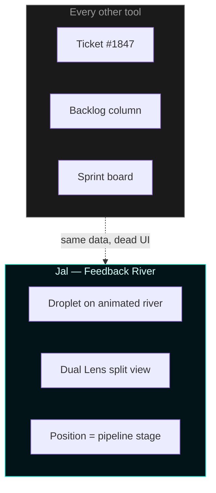
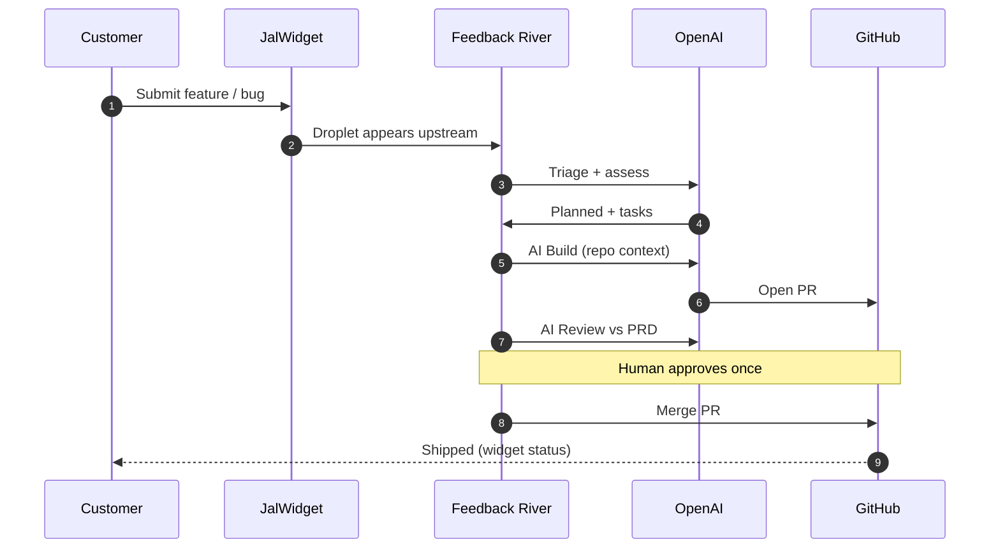
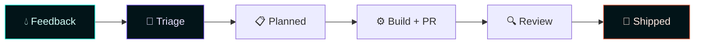
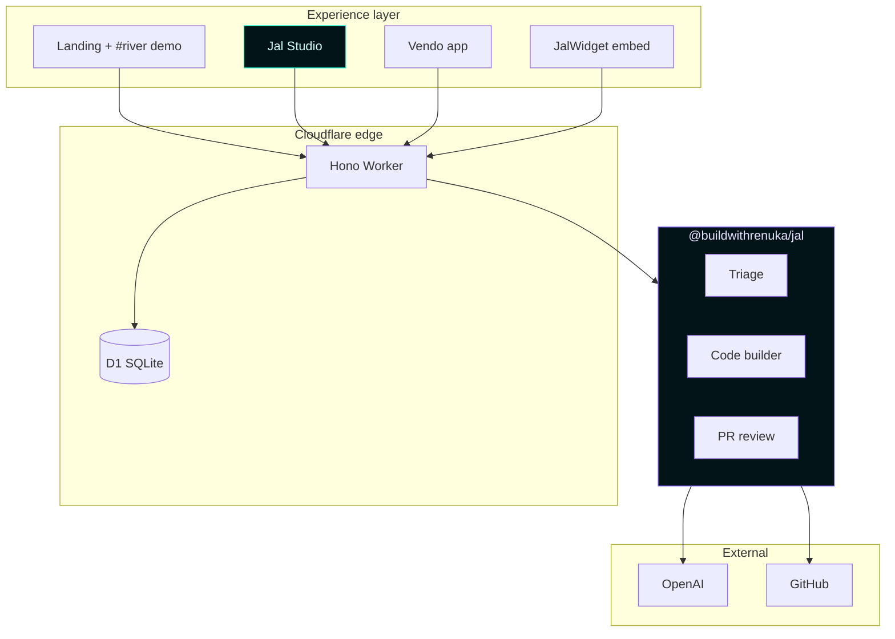

<div align="center">

# ✦ JAL

### We didn't build another ticket board. We built a **river**.

**Customer feedback flows in as droplets. AI triages, builds, opens PRs. You merge. Done.**

The world's first **Feedback River UI** — plus hosted **Jal Studio**, headless **`@buildwithrenuka/jal` npm**, and **Vendo** as live proof on a real product.

<br />

[](https://github.com/buildwithrenuka/vendo)
[](https://www.npmjs.com/package/@buildwithrenuka/jal)
[](https://workers.cloudflare.com/)
[](https://openai.com/)
[](https://react.dev/)
[](https://www.typescriptlang.org/)

<br />

| | |
|:---:|:---|
| **Live (production)** | [**vendo-api.renuka-khirwadkarr.workers.dev**](https://vendo-api.renuka-khirwadkarr.workers.dev) |
| **Try it (judges)** | [Homepage `#try`](https://vendo-api.renuka-khirwadkarr.workers.dev/#try) — one-click feature ideas |
| **Attach a repo** | [`/studio/onboard`](https://vendo-api.renuka-khirwadkarr.workers.dev/studio/onboard) |
| **See the river** | [`#river`](https://vendo-api.renuka-khirwadkarr.workers.dev/#river) → click droplets → Dual Lens |
| **Vendo demo** | [`/internal/login`](https://vendo-api.renuka-khirwadkarr.workers.dev/internal/login) · buyer [`/dashboard`](https://vendo-api.renuka-khirwadkarr.workers.dev/dashboard) |
| **Docs** | [`/docs`](https://vendo-api.renuka-khirwadkarr.workers.dev/docs) |
| **npm engine** | [`@buildwithrenuka/jal`](https://www.npmjs.com/package/@buildwithrenuka/jal) |
| **Product domain** | **`jal.app`** *(DNS migration in progress)* |

<br />

[90-Second Demo](#-90-second-demo-for-judges) · [Try It](#-try-it-jal--vendo) · [What's New](#-what-jal-invented) · [Quick Start](#-quick-start) · [Documentation](/docs) · [Studio](#-jal-studio) · [Architecture](#-architecture) · [API](#-api)

<br />

```bash
git clone https://github.com/buildwithrenuka/vendo.git && cd vendo && npm install && npm run dev
```

</div>

---

## ⚡ 90-second demo for judges

> **Goal:** Show something no other team has — feedback as a *living river*, not a spreadsheet.

| Step | Do this | What judges see |
|:----:|---------|-----------------|
| **1** | Open **`/`** (homepage) | Hero + **live pipeline animation** (Request → Merge) |
| **2** | Scroll to **`#river`** | Interactive river — **click any droplet** |
| **3** | Watch **Dual Lens** | Left = customer widget · Right = ship console · Same request |
| **4** | Scroll to **`#try`** | **One-click feature ideas** — pre-filled forms for Jal Studio & Vendo |
| **5** | Go **`/studio/onboard`** | Sign in → paste `owner/repo` → **Repo Pour** fills with AI context |
| **6** | Open **`/studio/projects/:id`** | Real **Feedback River** inbox — enqueue → AI Build → PR → merge |
| **7** | Optional: **`/internal/login`** | Vendo — same pipeline on a production procurement app |

**One-liner for the panel:** *"Jal closes the loop from customer widget to merged GitHub PR — with a UI metaphor nobody else ships."*

---

## 🎯 Try it — Jal & Vendo

**Jal** is the product. **Vendo** is the live demo app (procurement) proving the same pipeline on a real product. Both run on one deploy — judges pick a path:

| Path | Who it's for | Start here | Pre-filled ideas |
|------|--------------|------------|------------------|
| **Jal Studio** | Attach any GitHub repo | [`/studio/onboard`](https://vendo-api.renuka-khirwadkarr.workers.dev/studio/onboard) | Homepage **`#try`** → Studio cards |
| **Vendo demo** | See Jal on a real SaaS | [Google sign-in → Feedback](https://vendo-api.renuka-khirwadkarr.workers.dev/api/auth/google?redirect=%2Fdashboard%3Ftab%3Dfeedback) | Homepage **`#try`** → Vendo cards |
| **Dev queue** | Internal ship console | [`/internal/login`](https://vendo-api.renuka-khirwadkarr.workers.dev/internal/login) | Enqueue → AI Build → merge |

### Sample ideas judges can try in ~2 minutes

**Jal Studio:** public changelog from shipped feedback · Slack ping when PR ready · merge duplicate river droplets · widget theme from host brand

**Vendo demo:** bulk supplier CSV invite · GST invoice PO match · WhatsApp onboarding nudge · supplier scorecard PDF export

Click any card on **`#try`** — the form opens **pre-filled**. Submit and watch AI triage immediately.

---

## 💡 What Jal invented

Every product tool looks the same: **lists, kanban, gray boxes.**  
Jal asks: *what if feedback behaved like water?*



### Five UI primitives (not features — *inventions*)

| Primitive | What it replaces | Experience |
|-----------|------------------|------------|
| **Feedback River** | Ticket list / inbox grid | Each request is a **droplet** on an SVG stream — `left %` = pipeline progress |
| **Dual Lens** | Single admin view | **Customer lens** (widget mock) ↔ **Ship lens** (PR, tasks) — one stream, two truths |
| **Repo Pour** | "Connect GitHub" form | Liquid vessel **fills** as AI absorbs README + stack — onboarding as ritual |
| **Nexus** | Project list table | Projects orbit a central core — **tributaries** feeding one engine |
| **Phosphor Abyss** | Generic cyan SaaS | Color **is narrative**: cold phosphor intake → violet depth → coral ship |

Interactive proof: homepage **`#river`** · production UI: **`/studio/projects/:id`**

---

## 🔁 End-to-end: widget → merge

One continuous loop. Fully traceable. No black holes.



| Stage | AI does | Human does |
|-------|---------|------------|
| **Triage** | Classify, dedupe, scope, clarify | — |
| **Plan** | PRD outline + engineering tasks | Approve direction |
| **Build** | Read attached repo, implement, open PR | — |
| **Review** | Validate diff vs requirements | Fix or escalate |
| **Ship** | — | One-click merge |

---

## 🚪 Three doors. One engine.

<table>
<tr>
<td width="33%" valign="top">

### 🎨 Jal Studio
**Zero setup · browser-only**

Attach GitHub → AI scans context → drop widget → ship from UI.

```
/studio          Nexus
/studio/onboard  Repo Pour
/studio/projects Live River + Dual Lens
/.../embed       Widget + API key
```

[**Open Studio →**](http://localhost:5173/studio/onboard)

</td>
<td width="33%" valign="top">

### 📦 `@buildwithrenuka/jal`
**Full control · your infra**

Same pipeline as npm — triage, tasks, build, PR, merge.

```bash
npm install @buildwithrenuka/jal
```

Profiles: `vendo` · `travel` · `generic`

[**Package docs →**](packages/shipflow/README.md)

</td>
<td width="33%" valign="top">

### 🏢 Vendo
**Live proof · real product**

Procurement app with buyer widget + internal dev queue.

```
/dashboard       Buyer + feature requests
/internal        Dev queue + AI build
```

Not a mock — production patterns.

[**Dev demo →**](http://localhost:5173/internal/login)

</td>
</tr>
</table>

---

## 🌊 The Feedback River



**Studio routes**

| Route | Purpose |
|-------|---------|
| `/studio` | Nexus — all projects as tributaries |
| `/studio/onboard` | Pour repo → AI absorb → API key |
| `/studio/projects/:id` | **Live river** + Dual Lens + Ship console |
| `/studio/projects/:id/embed` | `<JalWidget />` snippet + iframe |
| `/embed/:projectId` | Public embed page |

**Studio API** (`/studio`)

| Method | Path | Auth |
|--------|------|------|
| `GET` | `/studio/setup` | Public readiness check |
| `POST` | `/studio/projects` | Session → project + `jal_live_*` key |
| `POST` | `/studio/projects/:id/scan` | AI repo context scan |
| `GET` | `/studio/projects/:id/inbox` | River droplets |
| `POST` | `/studio/projects/:id/features/:id/build` | AI code → GitHub PR |
| `POST` | `/studio/projects/:id/features/:id/approve-ship` | Merge PR |
| `POST` | `/studio/feedback` | `Bearer jal_live_*` widget submit |

---

## 🚀 Quick start

```bash
git clone https://github.com/buildwithrenuka/vendo.git
cd vendo && npm install

npm run build --workspace @vendo/shared
npm run build --workspace @vendo/forms

cp apps/api/.dev.vars.example apps/api/.dev.vars
cp apps/web/.env.example apps/web/.env
# SESSION_SECRET (32+ chars) · OPENAI_API_KEY · GITHUB_TOKEN for Studio

npm run db:migrate:local
npm run dev
```

| Service | URL |
|---------|-----|
| Web | `http://localhost:5173` |
| API | `http://localhost:8787` |
| Health | `GET /health` |
| Studio | `/studio/onboard` |
| **Docs** | [`/docs`](http://localhost:5173/docs) — step-by-step guides (Expo-style) |
| **Live** | [workers.dev deploy](https://vendo-api.renuka-khirwadkarr.workers.dev) |

### Widget in your app

```tsx
<JalWidget
  projectId="your-project-id"
  apiKey="jal_live_..."
  productName="My App"
  placement="bottom-right"
/>
```

### npm (headless)

```typescript
import { loadJalContext, triageFeatureRequest, runAiCodeBuilder } from "@buildwithrenuka/jal";

const jal = loadJalContext({ JAL_PROFILE: "generic", JAL_PRODUCT_NAME: "My SaaS" });
```

### Vendo admin seed

```bash
npm run seed:admin --workspace @vendo/api
# → /internal/login  (admin / VendoAdmin123!)
```

---

## 🏗 Architecture



```
vendo/
├── apps/
│   ├── api/              Cloudflare Worker — /studio, /dev, /buyer, …
│   └── web/              React 19 · Vite · Tailwind 4 · Feedback River UI
├── packages/
│   ├── shared/           Types · Jal project models · status labels
│   ├── forms/            Zod schemas · field catalog
│   └── shipflow/         @buildwithrenuka/jal — portable AI pipeline
└── package.json
```

| Layer | Technology |
|-------|------------|
| Frontend | React 19 · Vite 6 · Tailwind CSS 4 · Sora + Figtree |
| API | Cloudflare Workers · Hono · D1 |
| AI | OpenAI — triage · codegen · PR review |
| GitHub | Repo scan · branch · PR · merge |
| Auth | Google OAuth · OIDC · employee login |

---

## 🎨 Phosphor Abyss

Jal's color system maps **lifecycle to hue** — not decoration, narrative.

| Token | Hex | Meaning |
|-------|-----|---------|
| Phosphor | `#00f5d4` | New feedback · river flow |
| Current | `#7c5cff` | Pipeline depth · dev lens |
| Coral | `#ff6b4a` | Customer warmth · bugs · shipped |
| Abyss | `#010a0f` | Deep trench background |

CSS: `apps/web/src/index.css` · Tokens: `apps/web/src/lib/jal-brand.ts`

---

## 🏢 Vendo (reference demo — not the product)

**Jal** ships on **`jal.app`**. **Vendo** is the bundled demo app so judges can try the pipeline on a **real procurement product** without attaching their own repo.

| Module | Route | Jal integration |
|--------|-------|-----------------|
| Buyer dashboard | `/dashboard` | Feature request widget → AI triage |
| Internal queue | `/internal` | Full dev pipeline → GitHub PRs |
| Supplier onboarding | `/invite/:token` | Separate product surface |

**Vendo-specific:** WhatsApp invites · compliance forms · auto-approve rules · GST reconciliation *(Enterprise)*

Set `GITHUB_REPO=buildwithrenuka/vendo` for internal **AI Build** PRs.

---

## 🔐 Environment · Deploy · DB

<details>
<summary><strong>Environment variables</strong></summary>

| Variable | Required | Purpose |
|----------|:--------:|---------|
| `SESSION_SECRET` | ✅ | Cookie signing |
| `OPENAI_API_KEY` | 🤖 | AI pipeline |
| `GITHUB_TOKEN` | 🐙 | Repo scan + PR automation |
| `GITHUB_REPO` | 🐙 | Vendo internal PR target |
| `GOOGLE_CLIENT_*` | 🔑 | Studio + buyer auth |

Full list: [`apps/api/.dev.vars.example`](apps/api/.dev.vars.example)

</details>

<details>
<summary><strong>Deploy</strong></summary>

**Live:** [https://vendo-api.renuka-khirwadkarr.workers.dev](https://vendo-api.renuka-khirwadkarr.workers.dev)  
**Product domain:** `jal.app` — add zone on Cloudflare, point NS, then enable custom domain in `wrangler.jsonc`

```bash
# One command — builds web + deploys Worker + static assets
npm run deploy:all --workspace @vendo/api

# First-time setup
npm run db:migrate:remote --workspace @vendo/api
cd apps/api && npx wrangler secret bulk .deploy-secrets.env   # see .dev.vars.example

# After jal.app is on Cloudflare — Resend DNS records
npm run setup:dns --workspace @vendo/api
```

Email sender: `hello@jal.app` (Resend domain verify required).

</details>

<details>
<summary><strong>Database — 9 migrations on D1</strong></summary>

| Migration | Adds |
|-----------|------|
| `0001`–`0008` | Users, invites, forms, feature requests, dev queue, employees |
| **`0009_jal_studio`** | **`jal_projects`, project-scoped feedback, API keys** |

</details>

<details>
<summary><strong>Scripts</strong></summary>

```bash
npm run dev              # API + web
npm run typecheck        # All workspaces
npm run db:migrate:local # Local D1
```

</details>

---

## 🌐 API map

| Prefix | Purpose |
|--------|---------|
| `/studio` | **Jal Studio** — projects, river, widget, dev queue |
| `/dev` | Vendo internal queue |
| `/buyer` | Profiles · forms · feature requests |
| `/supplier` | Onboarding submissions |
| `/auth` · `/me` | Sessions |

---

## 💎 Pricing

| Free trial | Pro $49/mo | Team |
|------------|------------|------|
| 3 pipeline runs | Unlimited runs | SSO + SLA |
| 1 repo | Multi-repo | Custom context |
| Widget + triage | PR automation | Dedicated support |

Vendo: **Standard** (3 suppliers free) · **Enterprise** (GST, unlimited)

---

<div align="center">

<br />

## Like water — one pipeline, any product shape.

**Feedback River** · **Dual Lens** · **Repo Pour** · **OpenAI → GitHub**

<br />

[**▶ Run the demo**](http://localhost:5173) · [**Attach a repo**](http://localhost:5173/studio/onboard) · [**npm**](https://www.npmjs.com/package/@buildwithrenuka/jal) · [**GitHub**](https://github.com/buildwithrenuka/vendo)

<br />

*Built by [buildwithrenuka](https://github.com/buildwithrenuka) · Private*

</div>
